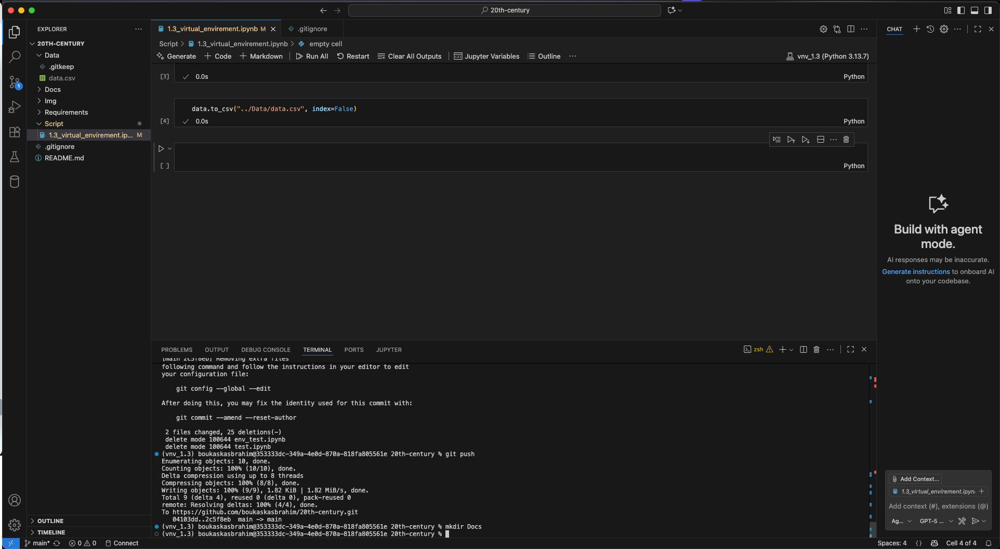
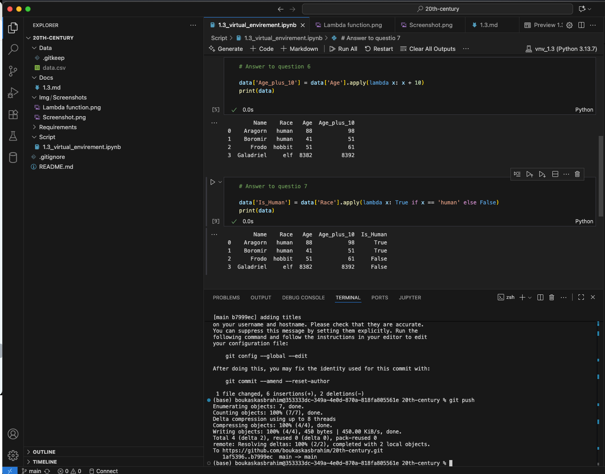
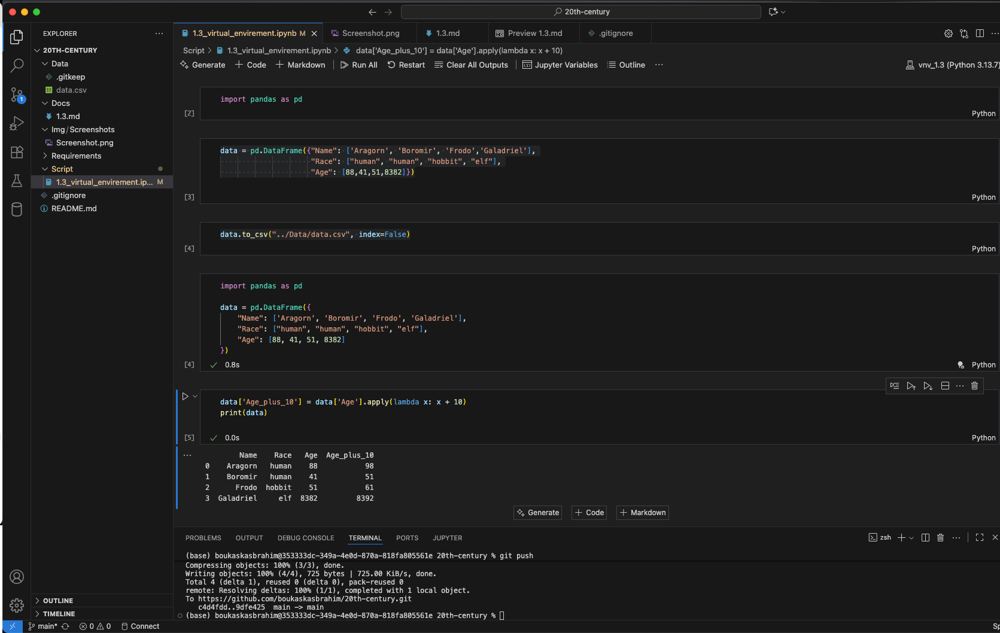

# 1.3 Virtual Environment

A short note on creating and using Python virtual environments for this project.

## Summary

This document shows a screenshot of the virtual environment setup used for the exercises in Section 1.3. It is intended as a visual aid — see the repository's `Script/1.3_virtual_envirement.ipynb` notebook for step-by-step commands.

## Screenshot

## Notes

- The notebook `Script/1.3_virtual_envirement.ipynb` contains the exact commands and explanations.
- If the image does not display, check the relative path `../Img/Screenshots/Screenshot.png` from this `Docs` folder.

## Additional Screenshots

### Answers 6 & 7

Caption: Screenshots showing answers for exercises 6 and 7.

### Lambda Function

Caption: Screenshot of the Lambda function configuration/output.

---

Updated: 2025-10-11